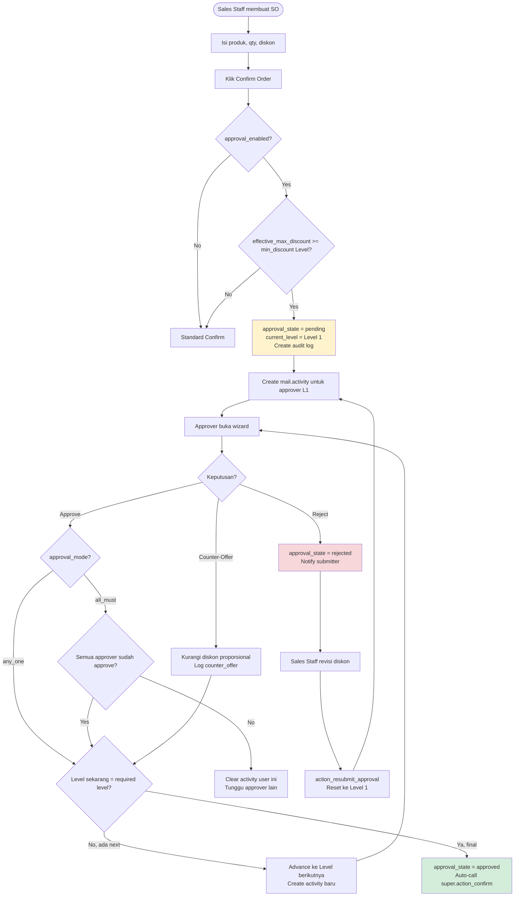
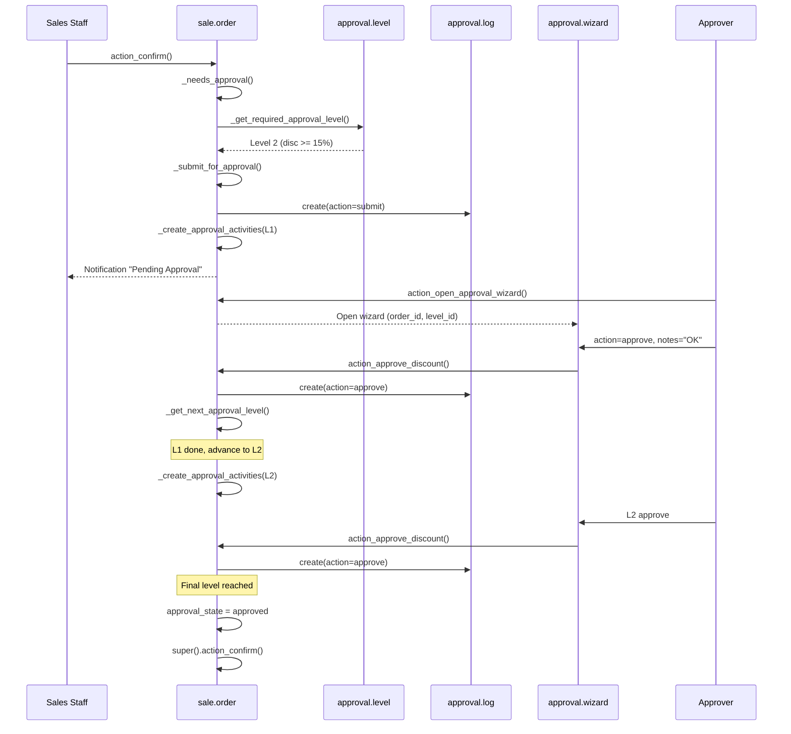
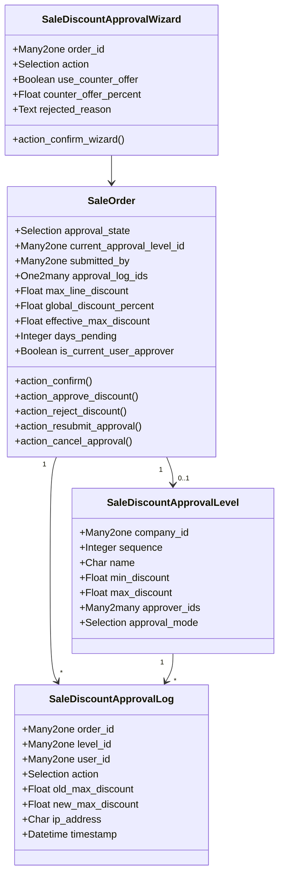
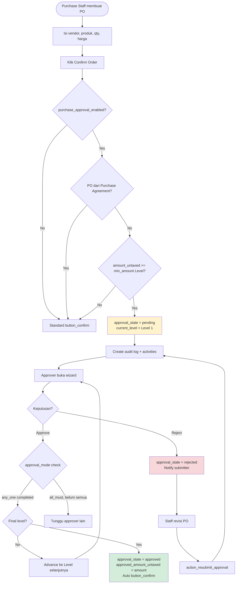
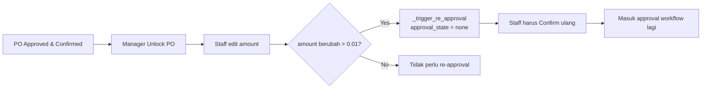
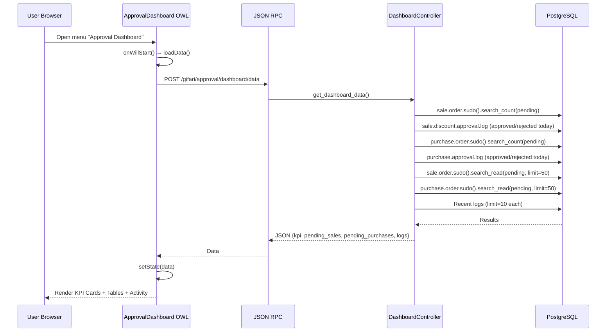
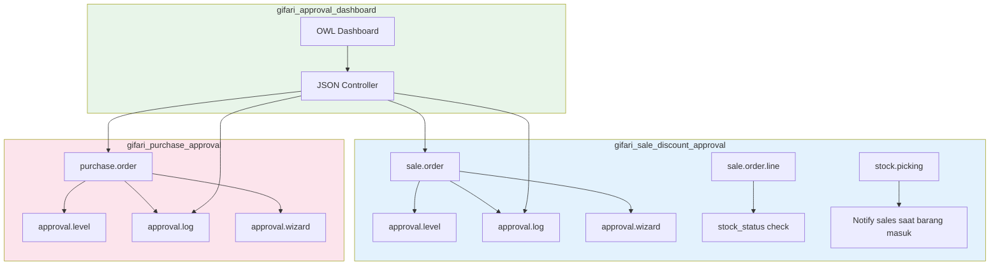

# End-to-End Documentation: PT Indopora Approval System

## Overview

Tiga modul kustom Odoo 19 Community untuk sistem persetujuan bertingkat:

| # | Modul | Fungsi |
|---|-------|--------|
| 1 | `gifari_sale_discount_approval` | N-level approval berbasis persentase diskon SO |
| 2 | `gifari_purchase_approval` | N-level approval berbasis nilai amount PO |
| 3 | `gifari_approval_dashboard` | OWL dashboard monitoring terpusat |

---

## Module 1: Sale Discount Approval

### Arsitektur Model

| Model | Tipe | Deskripsi |
|-------|------|-----------|
| `sale.order` | `_inherit` | Override `action_confirm()`, approval workflow |
| `sale.order.line` | `_inherit` | Stock availability check (`stock_status`) |
| `sale.discount.approval.level` | New Model | Konfigurasi level approval (N-level) |
| `sale.discount.approval.log` | New Model | Audit trail setiap aksi approval |
| `sale.discount.approval.wizard` | TransientModel | Dialog approve/reject/counter-offer |
| `stock.picking` | `_inherit` | Notifikasi saat barang diterima gudang |
| `res.company` | `_inherit` | Toggle `sale_disc_approval_enabled` |
| `res.config.settings` | `_inherit` | UI Settings |

### Fitur Utama
- **N-Level Sequential Approval** (L1 → L2 → L3)
- **Approval Mode**: Any One / All Must Approve
- **Counter-Offer**: Approver bisa turunkan diskon proporsional
- **OR Logic**: Cek per-line discount DAN global discount
- **Audit Trail**: IP address, timestamp, user, action
- **In-App Activity Notification** ke approver
- **Stock Availability Warning** pada SO line
- **Cross-Module Notification** saat barang diterima di gudang

### Flow Diagram



### Sequence Diagram



### Class Diagram



---

## Module 2: Purchase Approval

### Arsitektur Model

| Model | Tipe | Deskripsi |
|-------|------|-----------|
| `purchase.order` | `_inherit` | Override `button_confirm()` & `_approval_allowed()` |
| `purchase.approval.level` | New Model | Konfigurasi level approval berbasis amount |
| `purchase.approval.log` | New Model | Audit trail aksi approval |
| `purchase.approval.wizard` | TransientModel | Dialog approve/reject |
| `res.company` | `_inherit` | Toggle `purchase_approval_enabled` |

### Fitur Utama
- **N-Level Sequential Approval** berbasis `amount_untaxed`
- **Approval Mode**: Any One / All Must Approve
- **Bypass** untuk PO dari Purchase Agreement
- **Re-Approval** otomatis saat PO yang sudah approved di-unlock dan amount berubah
- **Override `_approval_allowed()`** untuk integrasi dengan logic bawaan Odoo
- **Audit Trail** lengkap dengan IP address

### Flow Diagram



### Re-Approval Flow (Unlock + Edit)



---

## Module 3: Approval Dashboard

### Arsitektur

| Komponen | File | Deskripsi |
|----------|------|-----------|
| Controller | `dashboard_controller.py` | JSON RPC endpoint `/gifari/approval/dashboard/data` |
| OWL Component | `approval_dashboard.js` | Frontend component dengan `useState`, `onWillStart` |
| Template | `approval_dashboard.xml` | QWeb template untuk KPI cards, tabel, activity log |
| Stylesheet | `approval_dashboard.css` | Custom styling |
| Action | `dashboard_action.xml` | `ir.actions.client` tag registration |

### Dashboard Data Flow



### KPI Cards

| KPI | Sumber Data | Query |
|-----|-------------|-------|
| Total Pending | SO + PO | `approval_state = pending` |
| Sale Pending | SO | `sale.order` pending count |
| Purchase Pending | PO | `purchase.order` pending count |
| Approved Today | Logs | `action = approve, timestamp >= today` |
| Rejected Today | Logs | `action = reject, timestamp >= today` |

### Fitur Interaktif
- **Tab Navigation**: Sales / Purchases / Activity
- **Aging Indicator**: OK (0d) / Warning (1-2d) / Critical (3d+)
- **Click-to-Open**: Klik order name → buka form view
- **Quick Navigation**: Klik KPI card → buka filtered list
- **Refresh Button**: Reload data real-time

---

## End-to-End Integration Flow



---

## Test Case Scenarios

### TC-SALE: Sale Discount Approval

| ID | Scenario | Precondition | Steps | Expected Result |
|----|----------|-------------|-------|-----------------|
| TC-S01 | SO tanpa diskon, confirm langsung | L1 min_discount=10%, SO diskon=0% | 1. Buat SO, 2. Confirm | `approval_state` tetap `none`, SO confirmed |
| TC-S02 | SO diskon 5% (di bawah threshold) | L1 min=10% | 1. Buat SO diskon 5%, 2. Confirm | Langsung confirmed tanpa approval |
| TC-S03 | SO diskon 12% trigger L1 | L1 min=10% | 1. Buat SO diskon 12%, 2. Confirm | `approval_state=pending`, `current_level=L1` |
| TC-S04 | Approve L1 (any_one mode) | TC-S03, mode=any_one | Approver L1 approve via wizard | Jika L1 = final → `approved` + auto-confirm |
| TC-S05 | Approve L1 → advance L2 | L1 min=10%, L2 min=20%, diskon=25% | Approve L1 | `current_level` pindah ke L2 |
| TC-S06 | All-must-approve mode | L1 mode=all_must, 2 approver | Approver-A approve | Status tetap pending, tunggu Approver-B |
| TC-S07 | All approvers done | TC-S06 | Approver-B approve | Level completed, advance/final |
| TC-S08 | Reject SO | SO pending | Approver reject + reason | `approval_state=rejected`, notifikasi ke submitter |
| TC-S09 | Resubmit setelah reject | SO rejected | Sales klik Resubmit | Reset ke pending L1, activity baru dibuat |
| TC-S10 | Counter-offer | SO pending, diskon=20% | Approve + counter=15% | Semua line discount dikurangi proporsional |
| TC-S11 | Cancel approval | SO pending | Submitter cancel | `approval_state=none`, activities cleared |
| TC-S12 | Confirm saat pending | SO pending | User klik confirm lagi | `UserError` raised |
| TC-S13 | Non-approver coba approve | SO pending | User bukan approver buka wizard | `AccessError` raised |
| TC-S14 | Approval disabled | `sale_disc_approval_enabled=False` | Confirm SO diskon 50% | Langsung confirmed, bypass approval |
| TC-S15 | Stock status check | Product qty=10, SO qty=15 | Lihat SO line | `stock_status=partial`, `needs_purchase=True` |
| TC-S16 | Stock received notification | SO line needs_purchase=True | Validate incoming picking | Activity dibuat di SO untuk salesperson |

### TC-PURCHASE: Purchase Approval

| ID | Scenario | Precondition | Steps | Expected Result |
|----|----------|-------------|-------|-----------------|
| TC-P01 | PO di bawah threshold | L1 min_amount=5jt, PO=3jt | Confirm PO | Langsung confirmed tanpa approval |
| TC-P02 | PO melebihi threshold | L1 min=5jt, PO=8jt | Confirm PO | `approval_state=pending`, level=L1 |
| TC-P03 | Approve PO (any_one) | TC-P02 | Approver approve via wizard | `approved` + auto button_confirm |
| TC-P04 | Sequential L1→L2 | L1 min=5jt, L2 min=50jt, PO=70jt | Approve L1 | Advance ke L2 |
| TC-P05 | All-must-approve PO | L1 all_must, 3 approver | 2 dari 3 approve | Tetap pending |
| TC-P06 | All 3 approve | TC-P05 | Approver ke-3 approve | Level done → next/final |
| TC-P07 | Reject PO | PO pending | Reject + reason | `rejected`, notify submitter |
| TC-P08 | Resubmit PO | PO rejected | Resubmit | Reset pending L1 |
| TC-P09 | Bypass Purchase Agreement | PO dari requisition | Confirm | Skip multi-approval, standard flow |
| TC-P10 | Re-approval setelah edit | PO approved, unlocked | Edit amount +1jt | `approval_state=none`, log reset |
| TC-P11 | Re-confirm setelah reset | TC-P10 | Confirm lagi | Masuk approval workflow ulang |
| TC-P12 | Cancel approval PO | PO pending | Cancel | `approval_state=none` |
| TC-P13 | Override _approval_allowed | PO approved via custom | Standard check | Returns True |
| TC-P14 | Approval disabled | `purchase_approval_enabled=False` | Confirm PO 100jt | Standard Odoo flow |

### TC-DASHBOARD: Approval Dashboard

| ID | Scenario | Steps | Expected Result |
|----|----------|-------|-----------------|
| TC-D01 | Load dashboard | Buka menu dashboard | KPI cards tampil, loading spinner hilang |
| TC-D02 | KPI total pending | Ada 3 SO + 2 PO pending | Total Pending = 5 |
| TC-D03 | Approved today count | Approve 2 SO hari ini | Approved Today = 2 |
| TC-D04 | Tab Sales | Klik tab Sales | Tabel pending SO tampil |
| TC-D05 | Tab Purchases | Klik tab Purchases | Tabel pending PO tampil |
| TC-D06 | Tab Activity | Klik tab Activity | Recent logs tampil |
| TC-D07 | Click order name | Klik nama SO di tabel | Redirect ke form view SO |
| TC-D08 | Click KPI card Sale | Klik Sale Pending card | Buka list SO filtered pending |
| TC-D09 | Aging indicator | SO pending 3+ hari | Badge merah "aging-critical" |
| TC-D10 | Refresh button | Klik Refresh | Data reload, spinner muncul |
| TC-D11 | Multi-company | User di 2 company | Data filtered by `env.companies.ids` |
| TC-D12 | Empty state | Tidak ada pending | Tampil "No pending approvals" |

---

## Security Matrix

### Groups

| Group | Module | XML ID | Implied |
|-------|--------|--------|---------|
| Sale Discount Approval Manager | Sale | `group_sale_approval_manager` | `sales_team.group_sale_salesman` |
| Purchase Amount Approval Manager | Purchase | `group_purchase_approval_manager` | `purchase.group_purchase_user` |

### Access Control

| Model | Group | Read | Write | Create | Delete |
|-------|-------|------|-------|--------|--------|
| `sale.discount.approval.level` | Sale Approval Manager | ✅ | ✅ | ✅ | ✅ |
| `sale.discount.approval.level` | Sale User | ✅ | ❌ | ❌ | ❌ |
| `sale.discount.approval.log` | Sale Approval Manager | ✅ | ❌ | ✅ | ❌ |
| `sale.discount.approval.log` | Sale User | ✅ | ❌ | ❌ | ❌ |
| `purchase.approval.level` | Purchase Approval Manager | ✅ | ✅ | ✅ | ✅ |
| `purchase.approval.level` | Purchase User | ✅ | ❌ | ❌ | ❌ |
| `purchase.approval.log` | Purchase Approval Manager | ✅ | ❌ | ✅ | ❌ |
| `purchase.approval.log` | Purchase User | ✅ | ❌ | ❌ | ❌ |

### Auto-Grant
Saat approver ditambahkan ke `approval.level`, sistem otomatis menambahkan user ke group manager via `create()` dan `write()` override.

---

## Configuration Guide

### 1. Aktivasi Sale Discount Approval
```
Settings → Sales → Sale Discount Approval → Enable ✓
Discount Check Mode: Both (OR Logic)
```

### 2. Konfigurasi Level Sale
```
Sales → Configuration → Discount Approval Levels
- Level 1: "Sales Supervisor", min=10%, max=20%, approvers=[User A]
- Level 2: "Sales Manager", min=20%, max=50%, approvers=[User B]
- Level 3: "Director", min=50%, max=0(unlimited), approvers=[User C]
```

### 3. Aktivasi Purchase Approval
```
Settings → Purchase → Purchase Amount Approval → Enable ✓
```

### 4. Konfigurasi Level Purchase
```
Purchase → Configuration → Amount Approval Levels
- Level 1: "Purchasing Supervisor", min=5.000.000, approvers=[User X]
- Level 2: "Purchasing Manager", min=50.000.000, approvers=[User Y]
- Level 3: "Finance Director", min=200.000.000, approvers=[User Z]
```

---

## Tech Stack

| Layer | Technology |
|-------|-----------|
| Backend | Python 3.12+, Odoo 19 CE ORM |
| Database | PostgreSQL 15+ |
| Frontend Dashboard | OWL 2.0 (Odoo Web Library) |
| Views | XML inheritance (`xpath`) |
| Security | `res.groups.privilege`, `ir.model.access.csv`, `ir.rule` |
| Notifications | `mail.activity` framework |
| API | JSON RPC Controller (`@http.route`) |

---

*Generated: 2026-05-01 | PT Indopora Approval System v19.0.1.0.0*
