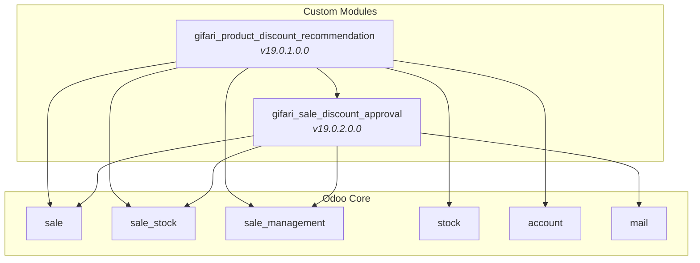
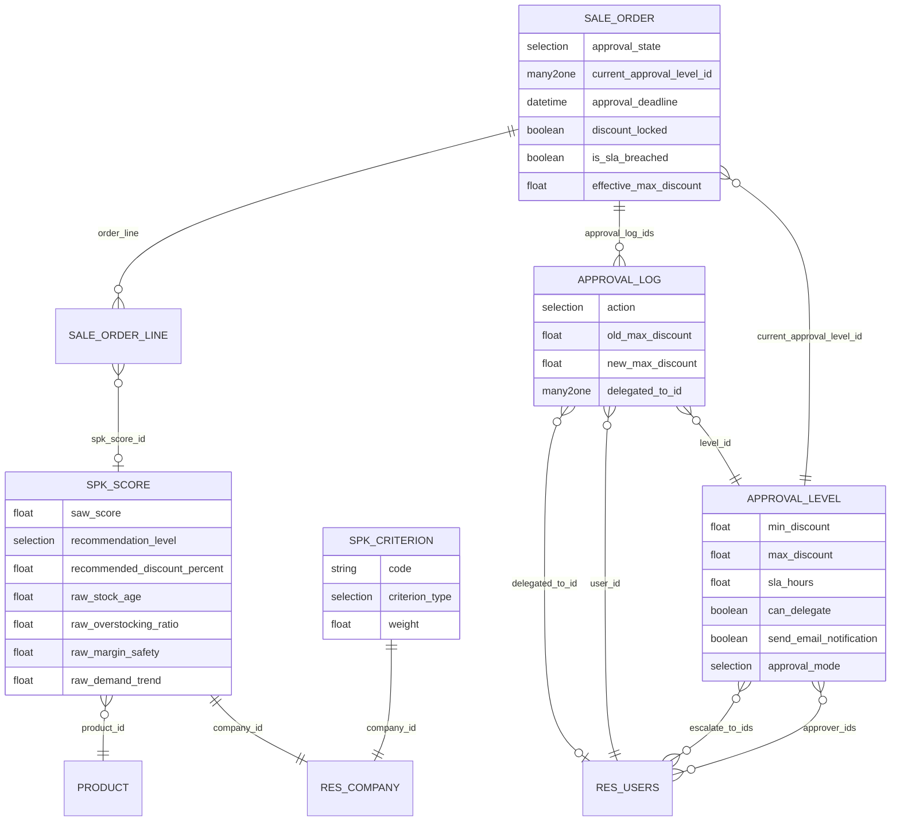
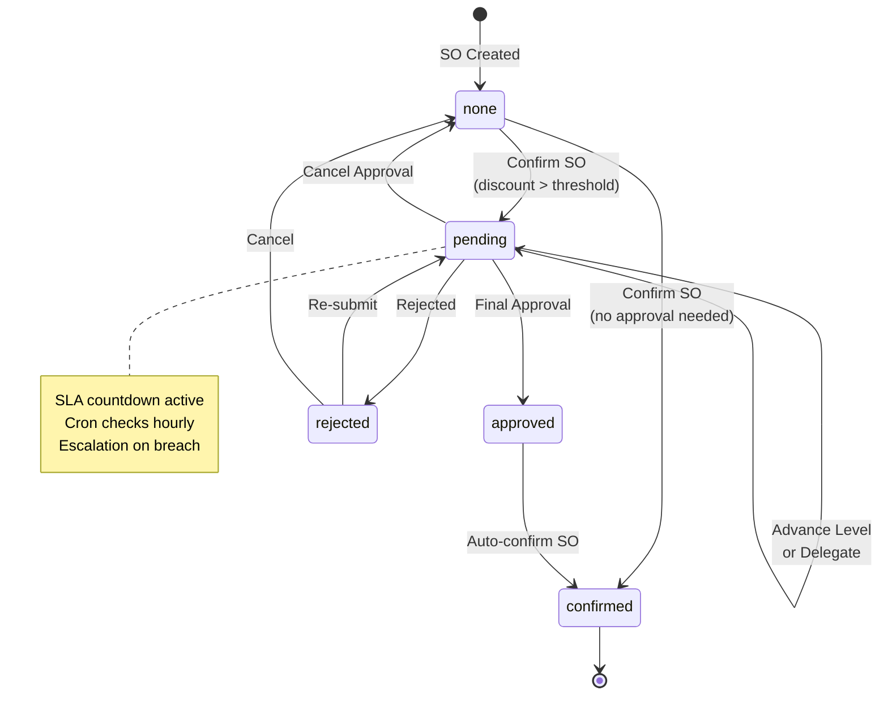
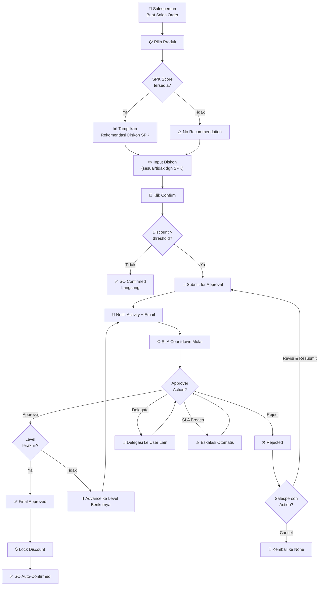
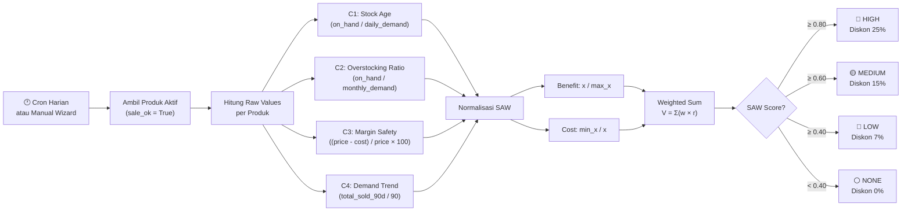
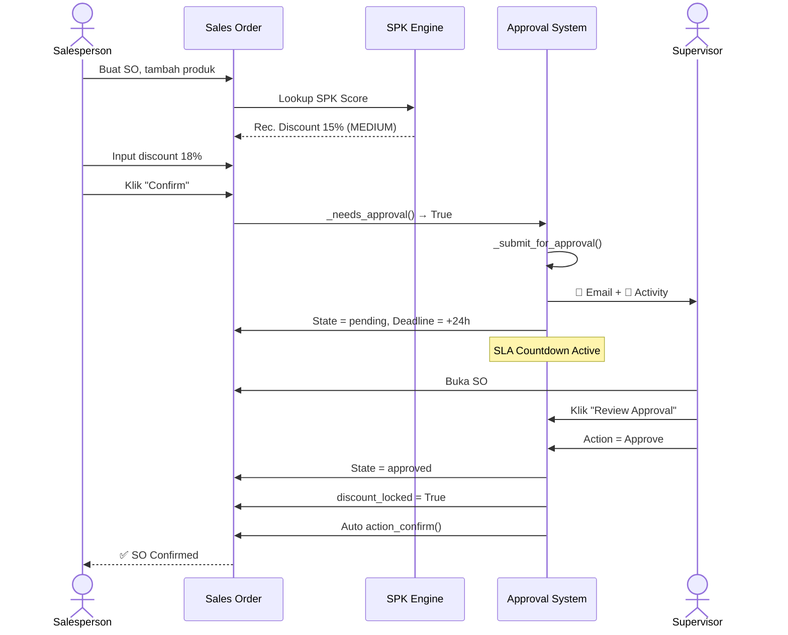
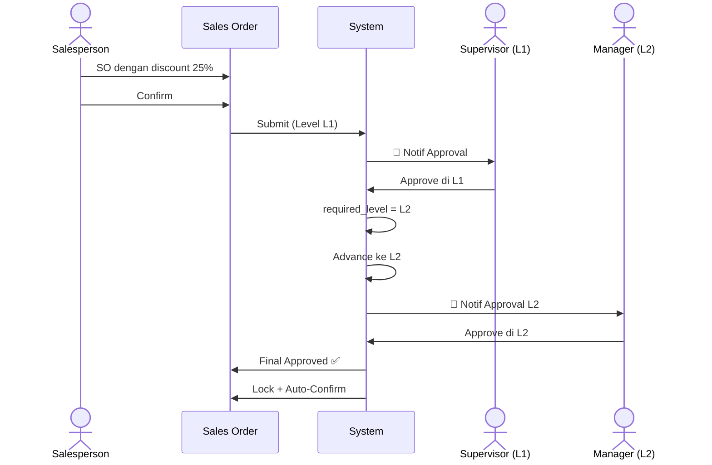
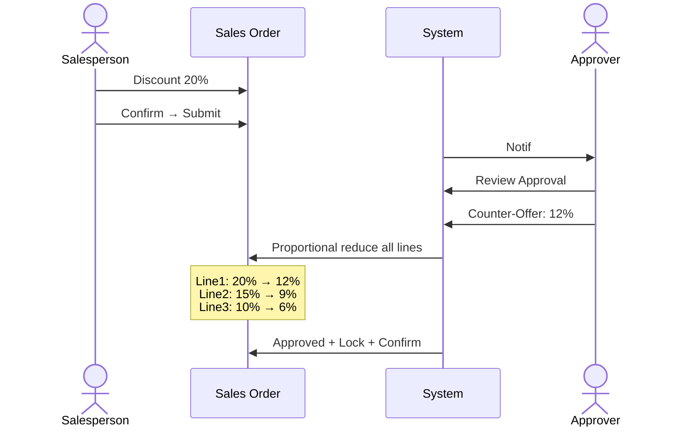
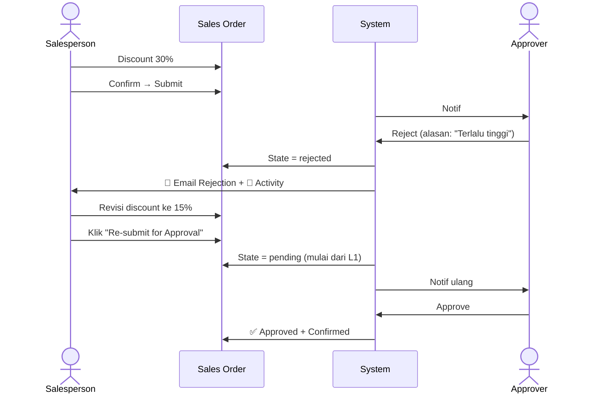
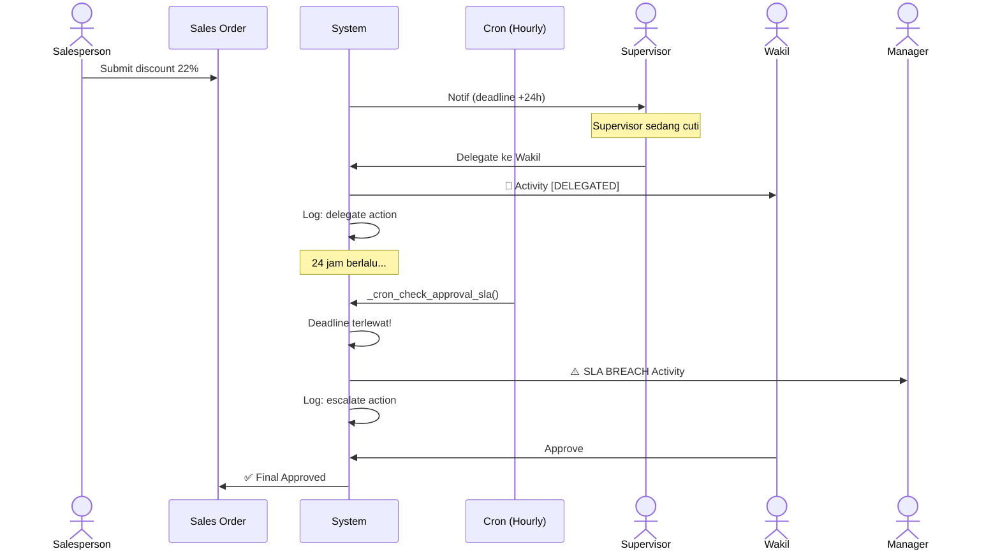

# 📘 Walkthrough: End-to-End SPK Discount Approval System
## Odoo 19 Community — PT Indopora (Anti Gravity)
### Author: Ikhwanudin Gifari — PT Indopora

---

## 1. Arsitektur Sistem

### 1.1 Module Dependency

### 1.2 Arsitektur Model & Relasi

---

## 2. Flow Utama Sistem

### 2.1 Approval Workflow — State Machine

### 2.2 Full End-to-End Flow

---

## 3. SAW Scoring Engine

### 3.1 Alur Komputasi SAW

### 3.2 Bobot Default Kriteria

| # | Kriteria | Code | Tipe | Bobot | Interpretasi |
|---|----------|------|------|-------|-------------|
| 1 | Stock Age | `stock_age` | Cost | 30% | Stok makin tua → makin prioritas diskon |
| 2 | Overstocking | `overstocking_ratio` | Cost | 25% | Overstock → prioritas diskon |
| 3 | Margin Safety | `margin_safety` | Benefit | 25% | Margin tinggi → aman diberi diskon |
| 4 | Demand Trend | `demand_trend` | Benefit | 20% | Demand tinggi → less urgent diskon |

---

## 4. Skenario End-to-End

### Skenario 1: Approval Standar (Single Level, Approve)

### Skenario 2: Multi-Level Approval (L1 → L2)

### Skenario 3: Counter-Offer

### Skenario 4: Rejection → Re-submit

### Skenario 5: Delegation + SLA Breach

---

## 5. Cron Jobs

| Cron | Model | Interval | Fungsi |
|------|-------|----------|--------|
| Sale Discount: Check Approval SLA | `sale.order` | 1 jam | Cek `approval_deadline < now`, kirim eskalasi |
| SPK SAW: Daily Product Scoring | `spk.saw.product.score` | 1 hari | Recalculate SAW score semua produk |

---

## 6. Security Matrix

| Model | Manager | Salesman |
|-------|---------|----------|
| `sale.discount.approval.level` | CRUD | R |
| `sale.discount.approval.log` | RWC | RC |
| `sale.discount.approval.wizard` | RWC | - |
| `spk.saw.criterion` | CRUD | R |
| `spk.saw.product.score` | CRUD | R |
| `spk.run.scoring.wizard` | RWC | - |

---

## 7. Mapping KPI → Teknis

| KPI | Sumber Data | Cara Ukur |
|-----|-------------|-----------|
| Approval Cycle Time | `days_pending` | AVG(days_pending) before vs after |
| SLA Compliance | `is_sla_breached`, log `escalate` | COUNT(escalate) / COUNT(submit) |
| Rejection Rate | log `reject` | COUNT(reject) / COUNT(submit) |
| Counter-offer Usage | log `counter_offer` | COUNT(counter_offer) / COUNT(approve) |
| Delegation Rate | log `delegate` | COUNT(delegate) / COUNT(submit) |
| SPK Acceptance Rate | `discount_variance_state = 'aligned'` | COUNT(aligned) / COUNT(with_rec) |

---

## 8. Verifikasi Post-Install Checklist

- [ ] Settings → Sales → Sale Discount Approval → field SLA muncul
- [ ] Sales → Discount Approval → Approval Levels → field SLA, delegate, email visible
- [ ] Sales → SPK Diskon → Kriteria SAW → 4 kriteria default ter-load
- [ ] Sales → SPK Diskon → Hitung Ulang Scoring → jalankan scoring pertama kali
- [ ] Buat SO baru → tambah produk → kolom SPK Rec. Disc. muncul
- [ ] Settings → Technical → Scheduled Actions → 2 cron aktif
- [ ] Test approval flow: submit → approve → auto-confirm + lock
- [ ] Test reject → re-submit flow
- [ ] Test delegate flow
- [ ] Verifikasi email template terkirim (jika mail server configured)

---

*Document Version: 1.0 — Prepared for PT Indopora*
*Odoo Version: 19.0 Community*
